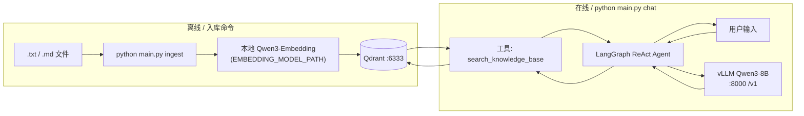
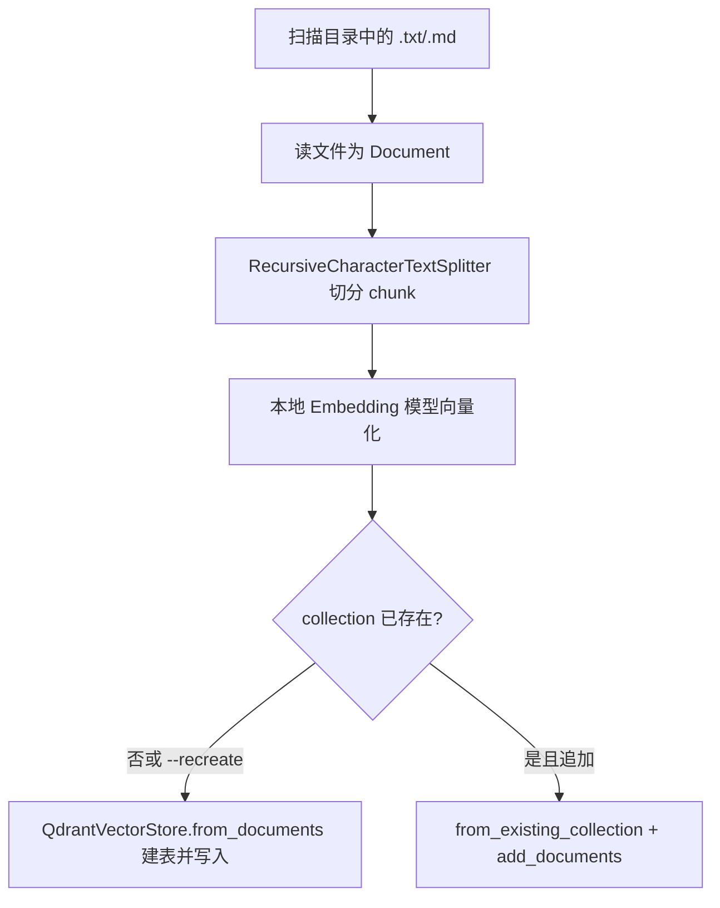
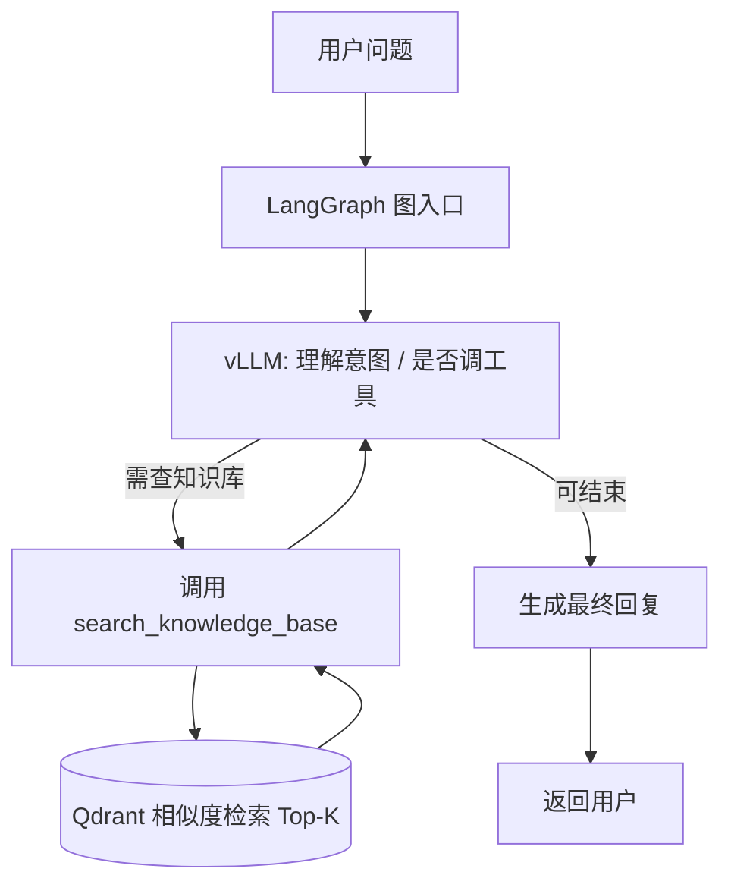

# Agentic RAG（memory 工作区）

基于 **LangGraph ReAct Agent + Qdrant + vLLM（OpenAI 兼容）+ 本地 Embedding** 的 RAG 框架。

## 文档与配置

- **[SETUP.md](./SETUP.md)** — 环境、vLLM / Qdrant / 依赖
- **`env.example`** — 复制为 **`.env`** 后修改路径与端口

## 目录结构

```
agentic-rag/
  agentic_rag/
    config.py       # 环境变量
    embeddings.py   # HuggingFace 本地向量模型
    qdrant_store.py # Qdrant 客户端与向量库
    tools.py        # 检索工具（供 Agent 调用）
    graph.py        # LangGraph ReAct 图
    ingest.py       # 文档入库
  main.py           # CLI：ingest / chat
  sample_docs/      # 示例文档
  deploy/           # vLLM 部署脚本（8B / embedding，可选）
```

---

## 流程概览与流程图

整体分两条线：**离线入库**（写入 Qdrant）与 **在线对话**（ReAct Agent + 检索）。实现上，Agent 由 `langgraph.prebuilt.create_react_agent` 编译（见 `agentic_rag/graph.py`），工具为 `search_knowledge_base`（底层是 Qdrant 向量检索）。

### 系统组件关系（部署视角）



### 入库流程（ingest）



### 对话流程（ReAct：模型决定何时检索）



说明：ReAct 可能 **多轮**「思考 → 调工具 → 再思考」；上图是典型单次检索路径的抽象。

---

## 第一次使用：先存数据，再对话

### 0. 前提（需已就绪）

| 服务 | 作用 |
|------|------|
| **Qdrant** | 向量库，监听 `6333`（与 `.env` 里 `QDRANT_URL` 一致） |
| **vLLM Qwen3-8B** | 对话模型，`http://127.0.0.1:8000/v1`（与 `VLLM_BASE_URL` 一致） |
| **Conda 环境** | 已 `pip install -r requirements.txt` |

说明：默认使用 `.env` 里的 **`EMBEDDING_BACKEND=openai`**，通过 **vLLM embedding 服务（`EMBEDDING_BASE_URL`，默认 `http://127.0.0.1:8001/v1`）** 做向量化，不会在 `chat` 进程里重复加载 embedding 模型。若需本地加载，可改为 `EMBEDDING_BACKEND=local`，再使用 `EMBEDDING_MODEL_PATH` + `EMBEDDING_DEVICE`。

### 1. 激活环境并进入目录

```bash
conda activate /DATA/disk4/workspace/zhongjian/memory/envs/agentic-rag
cd /DATA/disk4/workspace/zhongjian/memory/SEAMiLab-Deconstructing-Amnesia-main/agentic-rag
```

确保已配置 **`.env`**（从 `env.example` 复制并改路径）。

### 2. 把文档写入 Qdrant（「存数据库」）

只支持 **`.txt` / `.md`**。可把文件放在任意目录，例如项目自带的 `sample_docs/`，或你自己的目录。

**第一次建库（或清空重建）：**

```bash
python main.py ingest sample_docs --recreate
```

**以后追加新文件（不删已有 collection）：** 把新文档放进某目录后：

```bash
python main.py ingest /你的/文档/目录
```

成功时会打印类似：`Indexed N chunks into collection 'agentic_rag_docs'.`

### 3. 启动对话（Agentic RAG）

确保 **Qwen3-8B** 的 vLLM 已在跑，然后：

```bash
python main.py chat
```

在提示符下输入问题；Agent 会按需调用工具 **`search_knowledge_base`** 检索 Qdrant，再结合 LLM 回答。**空行或 Ctrl+D** 退出。

---

## 故障排除：`chat` 报 400，`auto tool choice requires ...`

若错误类似：

`"auto" tool choice requires --enable-auto-tool-choice and --tool-call-parser to be set`

说明 **vLLM 启动 Qwen3-8B 时未开启工具调用**。请用 **`deploy/deploy-qwen3-8B.sh`** 重启主模型（已包含 `--enable-auto-tool-choice` 与 `--tool-call-parser`，默认 `qwen3_xml`）。若仍异常，可尝试：

```bash
VLLM_TOOL_CALL_PARSER=hermes ./deploy/deploy-qwen3-8B.sh
```

### 只打印 `<tool_call>...</tool_call>`，没有检索后的最终回答？

多为 **Qwen3** 把工具调用写成 **XML 文本**，API 无法解析为 `tool_calls`，检索不会执行。

**默认已改为 `RAG_MODE=retrieve`**（`.env`）：**先向量检索再生成**，不依赖模型工具调用；直接重跑 `python main.py chat` 即可。若仍要用 ReAct，设 `RAG_MODE=react` 并保证 vLLM 工具解析正常。

---

## 说明

- 请先 **`ingest`**，再 **`chat`**；否则 `chat` 会提示没有 collection。  
- **Agent 对话**需要 vLLM 开启 **工具调用**（见上）；否则请改用非 ReAct 的检索流程（需改代码）。  
