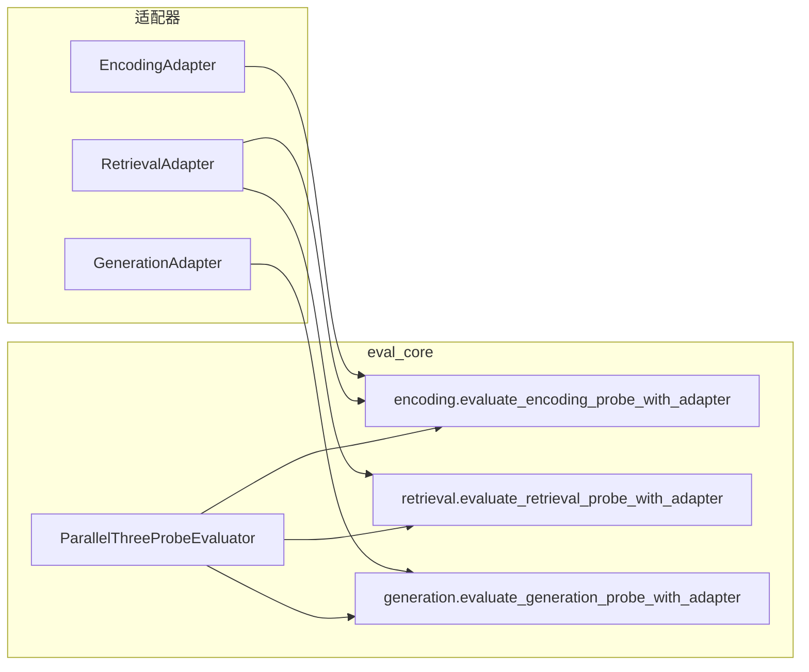

# 三探针评估框架：实现与设计分析（当前代码基线）

**文档性质**：与当前 `src/memory_eval/eval_core/` 实现对齐的架构说明，供复现与审计。  
**关联文档**：`encoding-layer-design-and-llm-only-policy-zh.md`、`docs/最终指标.md`。

---

## 1. 进度与范围（本轮已落地）

| 层级 | 职责（与你的需求对齐） | 实现要点 |
|------|------------------------|----------|
| **编码层** | 判断记忆系统是否**真实存储**标准证据 | 适配器提供 `M` 与候选；框架可选合并 **与检索探针同源的 `C_original`**；**严格模式**下仅 LLM 判 `encoding_state`，无规则兜底。 |
| **检索层** | 用**原生检索结果**与标准证据对比 | `retrieve_original` → LLM 判 `HIT/MISS/NOISE` 及缺陷；严格模式下 **不把 rank/SNR 自动补 LATE/NOI**（仅作 attrs 诊断，τ 写入 LLM 提示）。 |
| **生成层** | **A_oracle（完美上下文）**、**A_online** 与 **A_gold** 的 LLM 对比 | 严格模式下不以规则 `_is_correct_rule` / overlap 作为最终结论；POS 失败须 LLM 给出 **GF/GRF** 子类。 |

**严格探针判定**（`is_strict_llm_probe`）：`use_llm_assist ∧ require_llm_judgement ∧ disable_rule_fallback`。  
**LLM 调用失败**：`must_succeed` 与配置联动，失败抛 `RuntimeError`，不静默降级。

---

## 2. 模块边界与数据流

### 2.1 适配器路径（推荐：`evaluate_with_adapters`）

- **并行**：三探针在线程池中同时执行；归因阶段再合并（如对 `RF` 的屏蔽）。
- **编码层合并检索候选**（`encoding_merge_native_retrieval`，默认开）：在 `find_memory_records` / hybrid 之后，将 `retrieve_original(run_ctx, Q, k)` 的结果与候选 **按正文归一化去重合并**，`k = max(encoding_native_retrieval_top_k, top_k)`。优先调用编码适配器上的 `retrieve_original`，否则使用传入的 `retrieval_adapter`。

### 2.2 轨迹路径（`evaluate(sample, AdapterTrace)`）

- 编码探针输入为 `trace.memory_view` 作为候选，**不**经过「合并原生检索」分支（轨迹在构建时已固定观测）。
- 若需与适配器路径行为一致，应在构建 `AdapterTrace` 时把检索侧观测一并写入 `memory_view` 或扩展轨迹合同（当前未改合同）。

---

## 3. 各探针状态机与严格策略

### 3.1 编码（`encoding.py`）

1. 取 `M = export_full_memory`；候选：`hybrid_retrieve_candidates` → `find_memory_records` →（非 `disable_rule_fallback` 时）规则扫描兜底。
2. 可选合并原生检索候选（见上）。
3. **严格**：单次 `llm_judge_encoding_storage(..., must_succeed=True)`，校验 `encoding_state ∈ ENC_STATES`，直接返回。
4. **非严格**：可先 LLM，无效则走原 POS/NEG 规则路径（含 `llm_judge_fact_match` 可选）。

### 3.2 检索（`retrieval.py`）

- **NEG**：优先 `llm_judge_retrieval_quality_neg`；严格下**不再**用分数阈值 + `llm_judge_retrieval_noise` 兜底。
- **POS**：`llm_judge_retrieval_quality_pos` 带 `tau_rank` / `tau_snr` 写入 prompt；**非严格**时仍可按 rank/SNR 补 `LATE`/`NOI`；**严格**时仅以 LLM 返回的 `defects` 为准。
- **已知局限**：`evaluate_with_adapters` 中检索仍传 `s_enc=None`，并行无法在检索内部用编码状态门控 RF；最终由 `ParallelThreeProbeEvaluator` 在汇总时 **若 enc=MISS 则剔除 RF**。

### 3.3 生成（`generation.py`）

- 严格：`correct` / `online_correct` 初值不来自规则，完全由两次 LLM（`llm_judge_generation_answer`、`llm_judge_generation_comparison`）更新。
- POS 且 FAIL：严格要求 `llm_judgement.substate ∈ {GF, GRF}`，否则 `RuntimeError`（避免 overlap 规则兜底）。

---

## 4. 配置项（`EvaluatorConfig`）摘要

| 字段 | 作用 |
|------|------|
| `use_llm_assist` / `require_llm_judgement` / `disable_rule_fallback` | 三者同时为真 → 严格探针语义。 |
| `encoding_merge_native_retrieval` | 是否合并 `retrieve_original` 进编码候选。 |
| `encoding_native_retrieval_top_k` | 合并时最小 k，与 `top_k` 取 max。 |
| `tau_rank` / `tau_snr` | 写入 POS 检索 LLM 提示；非严格时仍可机械补缺陷。 |
| `neg_noise_score_threshold` | 仅非严格 NEG 规则路径。 |
| `strict_adapter_call` | 适配器异常是否上浮（如合并检索失败）。 |

---

## 5. 三轮自检结论（实现侧）

1. **一致性**：严格模式下编码/检索 NEG/生成均避免「LLM 失败 → 规则悄悄接管」；`llm_judge_retrieval_noise` 的 `must_succeed` 已贯通。  
2. **观测对齐**：适配器路径下编码候选与检索同源 top-k 合并，减少「库里有、候选里没给 LLM」的漏判风险。  
3. **残留风险**：并行评估时检索探针拿不到实时 `s_enc`（仅事后归因修正 RF）；轨迹模式无检索合并——若产品要完全统一，需串行门控或扩展 `AdapterTrace`。

---

## 6. 文件索引

| 路径 | 说明 |
|------|------|
| `eval_core/encoding.py` | 编码探针 + 合并检索候选 + 严格 LLM 早返回 |
| `eval_core/retrieval.py` | 检索探针 + 严格/非严格分支 |
| `eval_core/generation.py` | 生成探针 + 严格 GF/GRF |
| `eval_core/llm_assist.py` | OpenAI 兼容 JSON 调用与 `must_succeed` |
| `eval_core/utils.py` | `is_strict_llm_probe` 等 |
| `eval_core/engine.py` | 并行编排 + RF 屏蔽 |
| `eval_core/models.py` | `EvaluatorConfig` 与数据结构 |
