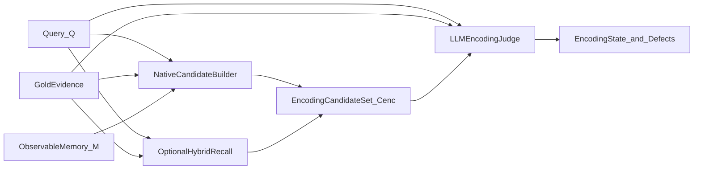

# 三探针严格方案解决文档（先文档、后实现）

**文档性质**：解决方案规范文档，先统一目标语义、约束和修复路线，**本阶段不修改代码**。  
**最高规范**：`docs/最终指标.md`。  
**关联文档**：
- `docs/architecture/encoding-layer-design-and-llm-only-policy-zh.md`
- `docs/architecture/adapter-requirements-and-fidelity-protocol-bilingual-v0.6.1.md`
- `docs/architecture/three-probe-framework-design-analysis-zh.md`

---

## 1. 目的与结论

当前仓库已经基本完成三探针评估层设计、O-Mem 复现和 O-Mem 适配器接入，但在“**真实评测必须开启 LLM、禁止降级、严格忠于原系统**”这一目标上，仍然存在少量规范与实现、实现与脚本、文档与默认入口之间的不完全一致。

这份文档的目的不是重复介绍三探针，而是把以下四件事彻底写清楚：

1. **编码层**到底如何判“系统是否真实存储了证据”，以及为什么这件事必须系统特化适配。
2. **检索层**为什么必须只看原系统真实 `C_original`，以及 LLM 在这一层的唯一职责是什么。
3. **生成层**为什么必须做 `A_online`、`A_oracle`、`A_gold` 三方比较，以及 GH/GF/GRF 应如何定义。
4. 为什么真实评测必须固定为 **严格 LLM-only / fail-fast / no fallback**，以及当前仓库后续应按什么顺序收敛。

本文的核心结论是：

- 三探针的整体方向是对的，接口分层也基本对了。
- 编码层必须被重新表述为“**存储存在性判定**”，不能退化成简单文本匹配。
- 检索层和生成层都应由 **LLM 给最终结论**，规则指标只允许保留为诊断属性。
- 对真实评测而言，**LLM 失败就是评测失败**，不允许静默回退到规则模式。

---

## 2. 最高规范与当前仓库状态

### 2.1 最高规范

`docs/最终指标.md` 已经给出了三探针的最终定义：

- 编码层 `P_enc`：判断 `Q` 所需证据是否真实存在于记忆库 `M` 中。
- 检索层 `P_ret`：判断原生检索结果 `C_original` 是否把关键证据放到了有效位置。
- 生成层 `P_gen`：判断在完美上下文 `C_oracle` 下，系统生成器是否仍然答错。
- 最终归因：`D_total = D_enc ∪ D_ret ∪ D_gen`，不是单因果覆盖，而是并行缺陷并集。

### 2.2 当前仓库已完成的部分

从当前仓库状态看，以下基础已经具备：

- 三探针评估核心位于 `src/memory_eval/eval_core/`，包含 `encoding.py`、`retrieval.py`、`generation.py`、`engine.py`、`llm_assist.py`、`models.py`。
- O-Mem 适配器主实现位于 `src/memory_eval/adapters/o_mem_adapter.py`。
- StableEval 复现链路位于 `system/O-Mem-StableEval/`。
- 适配器协议已经区分了：
  - `export_full_memory`
  - `find_memory_records`
  - `hybrid_retrieve_candidates`
  - `retrieve_original`
  - `generate_online_answer`
  - `generate_oracle_answer`
- 配置层已经存在严格模式相关开关：
  - `use_llm_assist`
  - `require_llm_judgement`
  - `disable_rule_fallback`
  - `strict_adapter_call`
  - `require_online_answer`

### 2.3 当前仓库仍然存在的关键张力

虽然主干接口已经成形，但仍有三个需要文档先统一的焦点：

1. **编码层的候选观测与检索层的原生观测之间如何保持一致。**
2. **严格模式下哪些规则逻辑还能存在，哪些必须被视为非法。**
3. **真实运行入口、实验入口、调试入口的语义必须区分清楚。**

---

## 3. 三探针的严格目标语义

## 3.1 编码层：存储存在性判定，而不是文本相似度任务

### 3.1.1 编码层真正要回答的问题

编码层要回答的是：

> 对于当前问题 `Q`，其真实证据 `F_key / evidence_texts / evidence_with_time / oracle_context` 所表达的信息，是否已经以**可观测**、**可审计**、**与该系统内部存储方式一致**的形式写入了当前记忆系统？

这一定义有三个关键词：

- **可观测**：评估器必须能看到系统里“现在有什么”。
- **可审计**：评估结果必须能回指到具体记录、字段、节点、chunk 或元数据。
- **系统一致**：JSON、KV、SQL、向量库、图谱、working memory、episodic memory 的判断方式不可能完全相同。

因此，编码层不是“把 `f_key` 和某段文本做相似度比对”这么简单，而是一个两阶段问题：

1. `Observability`：如何观察该系统的真实存储。
2. `Conformance`：在给定观测下，gold evidence 是否已经被视为“存在”。

### 3.1.2 为什么必须按系统做适配

同一条事实在不同系统中的存储形态可能完全不同：

- 在一个 JSON 系统中，它可能是一条扁平对象。
- 在一个 KV 系统中，它可能是“query-like key -> value”。
- 在一个向量数据库系统中，它可能只是一个 chunk 加 metadata。
- 在一个图记忆系统中，它可能被拆成多个 entity/relation/node。
- 在 O-Mem 一类系统中，它可能分散在 working/persona/episodic 不同层，并通过不同路径参与后续检索。

所以，编码层必须明确采用“**系统特化适配器 + 框架统一裁判**”模式：

- 适配器负责：
  - 访问真实存储。
  - 给出高召回候选。
  - 提供存储来源元数据。
- 评估框架负责：
  - 统一候选合同。
  - 统一 LLM prompt 与 JSON schema。
  - 统一状态/缺陷映射。

### 3.1.3 编码层允许框架提供混合检索，但不能替代系统特化适配

为了降低适配器工作量，编码层内部可以提供一个通用混合候选接口，但必须严格限定它的角色：

- 它的作用是**补充候选召回**，不是替代适配器的系统原生观测。
- 它可以帮助那些“有存储但不方便完整导出”的系统快速接入。
- 它不能成为“框架靠自己猜系统里有没有记住”的主路径。

因此，编码层的候选来源应定义为两级：

1. **一级来源，系统原生候选**  
   来自适配器直接访问真实存储结构的结果，是正式评测的首要依据。

2. **二级来源，框架通用混合候选**  
   只作为补充召回或调试辅助，不能单独支撑最终结论。

### 3.1.4 编码层的严格判定流程

建议固定为以下流程：

严格模式下，编码层必须满足：

- 输入必须包含 `Q + gold evidence + 候选集 + task_type`。
- 输出必须是严格 JSON。
- 结果必须映射到：
  - `EXIST`
  - `MISS`
  - `CORRUPT_AMBIG`
  - `CORRUPT_WRONG`
  - `DIRTY`
- 若 LLM 调用失败、JSON 失败、schema 不合法，则该 query 直接记为 `EVAL_ERROR`。
- 严禁“LLM 失败后再偷偷回到规则扫描得出一个状态”。

### 3.1.5 编码层与检索层的观测一致性要求

这是当前设计里最重要、也最容易被忽视的一条：

> 编码层判定“是否存了”，不能和检索层判定“检索到了什么”使用完全脱钩的观测集合。

否则就会出现用户已经见到的异常现象：

- `enc = MISS`
- `ret = HIT`

这种组合在理论上不是绝对错误，但如果没有额外说明，会直接削弱编码层的解释力。

因此，本方案要求：

1. 编码层候选 `C_enc` 默认应包含与 `retrieve_original` 同源的原生候选。
2. 如果某系统的编码层观测与检索层观测天然不同，适配器必须在 manifest 或报告中声明二者关系。
3. 对 O-Mem 这种多层记忆系统，编码层默认应合并：
   - `export_full_memory`
   - native retrieval top-N
   再送给 LLM 做存储性判定。

这不是把编码层变成检索层，而是为了避免“存了但编码候选没看见”的假 `MISS`。

---

## 3.2 检索层：只忠于原系统真实 `C_original`

### 3.2.1 检索层真正要回答的问题

检索层要回答的是：

> 当前这一次原生检索调用，是否把与 gold evidence 对应的关键信息，以对生成器有效的方式放进了 `C_original`？

这里必须强调“**当前这一次**”和“**原生检索**”：

- 不是问“系统内部有没有这个信息”，那是编码层的职责。
- 不是问“如果换一个更好的检索器能不能检出来”，那不是忠于原系统。
- 不是问“如果评估器自己重新搜一遍能不能搜出来”，那会破坏因果归因。

### 3.2.2 检索层的唯一合法输入

严格模式下，检索层只允许使用：

- 原系统真实函数产生的 `C_original`
- 当前问题 `Q`
- gold evidence

不允许使用：

- 评估器自己重新构造的候选集替代 `C_original`
- 适配器私自重排后的“更好结果”
- 一个与真实 answer path 不同的调试检索输出

### 3.2.3 检索层的严格职责划分

检索层中 LLM 和规则的职责必须分开：

**LLM 负责最终结论**

- `HIT`
- `MISS`
- `NOISE`
- `RF`
- `LATE`
- `NOI`
- `NIR`

**规则只保留为诊断属性**

- `rank`
- `hit_indices`
- `snr`
- `top_score`

这些规则属性可以出现在报告里，但在严格模式下，不能再承担“只要 rank 大于阈值就自动打 LATE”这类最终判定职责。

### 3.2.4 RF 的门控语义

`docs/最终指标.md` 已经明确：

- 只有当编码层不是纯 `MISS` 时，`RF` 才成立。

这意味着检索层的最终解释必须服从编码层：

- 若源头根本没存进去，检索层不应背 `RF`。
- 若编码层是 `EXIST` 或 `CORRUPT`，而原生检索没有把它召回，才应视为 `RF`。

因此，本方案要求：

- 要么在检索探针内部就拿到 `S_enc` 并严格门控。
- 要么像当前架构一样并行执行后，在引擎合并阶段显式屏蔽 `RF`。

两种都可以，但必须在文档、代码和结果解释上使用同一种口径。

---

## 3.3 生成层：三答案比较，而不是只看 `A_oracle`

### 3.3.1 生成层真正要回答的问题

生成层不是简单问：

> 给了标准证据，你能不能答对？

它真正要做的是三方对照：

- `A_gold`：标准答案
- `A_online`：原系统真实检索链路下的输出
- `A_oracle`：完美证据上下文下的输出

只有做这三方比较，才能回答以下问题：

- 当前错误是检索导致的，还是生成器本身就不会？
- 给了完美证据之后，模型是否仍然在幻觉？
- `A_online` 和 `A_oracle` 的差异究竟来自上游证据，还是来自生成器本身的不稳定？

### 3.3.2 生成层必须保持模型一致性

对于 `A_online` 和 `A_oracle`，必须保证：

- 同一个生成模型
- 同样的 decoding 参数
- 同样的 prompt 模板版本

否则生成层就失去因果解释力，因为你比较的将不再是“上下文差异”，而是“模型/参数差异”。

### 3.3.3 GH / GF / GRF 的规范定义

本方案建议把三类失败写成如下口径：

1. **GH**
   - 负样本。
   - 正确行为应为拒答。
   - `A_oracle` 仍然输出了不该生成的具体答案。

2. **GF**
   - 正样本。
   - `A_oracle` 错误。
   - 错误体现为没有忠实使用给定证据，偏向外部知识、惯性模板或脱离上下文的内容。

3. **GRF**
   - 正样本。
   - `A_oracle` 错误。
   - 但错误是在已读取证据前提下发生的推理/组合/时序/多跳失败。

严格模式下，这三个子类都应由 **LLM 给最终结论**。  
规则 overlap、字符串包含、拒答模板识别只能作为辅助信号，不得直接替代最终分类。

### 3.3.4 生成层的严格协议

严格模式下，生成层必须满足：

- 必须同时获得 `A_online` 与 `A_oracle`。
- LLM 必须同时比较：
  - `A_online vs A_gold`
  - `A_oracle vs A_gold`
  - `A_online vs A_oracle`
- 当 `A_oracle` 错误时，必须返回：
  - `generation_state`
  - `oracle_correct`
  - `online_correct`
  - `comparative_judgement`
  - `substate in {GH, GF, GRF}`

如果 LLM 没给出合法子类，结果应进入 `EVAL_ERROR`，而不是由规则逻辑擅自补出一个分类。

---

## 4. 严格 LLM-only / 禁止降级方案

## 4.1 唯一合法的真实评测配置

真实评测、论文复现实验、正式报告、CI 门禁应只承认以下 profile：

| 配置项 | 值 |
|------|----|
| `use_llm_assist` | `true` |
| `require_llm_judgement` | `true` |
| `disable_rule_fallback` | `true` |
| `strict_adapter_call` | `true` |
| `require_online_answer` | `true` |

可以把这个 profile 命名为：

- `PROD_STRICT_LLM`
- 或 `STRICT_EVAL_PROFILE`

名字本身不重要，重要的是它必须成为唯一被正式承认的评测模式。

## 4.2 必须明确禁止的行为

以下行为在真实评测中应被视为非法：

1. LLM 调用失败后回到规则判题。
2. JSON 解析失败后自动猜一个状态。
3. 编码层在 strict 下执行规则全库扫描补结论。
4. 检索层在 strict 下用 rank/SNR 直接补 `LATE/NOI` 最终缺陷。
5. 生成层在 strict 下用字符串相等、模板拒答识别或 overlap 直接补最终子类。
6. 脚本默认关闭 LLM 但仍把结果当正式结论使用。

## 4.3 合法保留但只能作为辅助属性的逻辑

以下逻辑并不是“错误”，但在 strict 下只能作为证据或属性，不得作为最终判定来源：

- 文本归一化
- token overlap
- rank
- SNR
- top score
- 拒答模板识别
- grounding overlap

它们应被写进：

- `attrs`
- `evidence`
- `decision_trace`

而不是直接变成状态机的裁决器。

## 4.4 Query 级错误协议

本方案要求每个 query 只允许三类最终执行状态：

- `EVAL_OK`
- `EVAL_ERROR_RUNTIME`
- `EVAL_ERROR_LLM`

一旦任一探针在 strict 模式下发生：

- 适配器错误
- LLM 调用错误
- JSON/schema 错误
- 必需字段缺失

则该 query 应进入错误状态，不得进入“猜测式成功”。

---

## 5. 当前仓库与目标架构的差距分析

本节只描述差距，不做代码修改。

## 5.1 编码层

### 已经具备的部分

- 已经支持 `export_full_memory`。
- 已经支持 `find_memory_records`。
- 已经支持 `hybrid_retrieve_candidates`。
- 已经支持把 native retrieval 合并进编码候选。
- 已经存在严格 LLM 编码判定路径。

### 仍需明确或收敛的部分

1. **编码观测合同仍需要文档正式定义。**  
   目前有 `id/text/meta` 的事实标准，但还没有把“什么叫可观测记忆视图”写成正式适配器规范。

2. **编码层的候选一致性仍需要被提升为规范。**  
   当前已经有“合并原生检索”的做法，但还应上升为一条明确架构约束，而不是实现细节。

3. **严格模式下的 fallback 语义需要彻底统一。**  
   文档、脚本、实现必须统一表述为：strict 下规则路径不可作为最终判定来源。

## 5.2 检索层

### 已经具备的部分

- 原生 `C_original` 已经是核心输入。
- POS/NEG 都有 LLM 裁判入口。
- strict 下已经不再自动把 `rank/SNR` 补成 POS 最终缺陷。

### 仍需明确或收敛的部分

1. **RF 门控位置需要统一解释。**  
   当前可以在引擎汇总阶段完成，但文档必须明确这不是“放松标准”，而是因为三探针并行执行的工程折中。

2. **检索报告中必须区分“最终缺陷”和“诊断属性”。**  
   否则用户会误以为 `rank` 和 `snr` 仍在 strict 下直接决定结论。

## 5.3 生成层

### 已经具备的部分

- 已经有 `A_online`、`A_oracle`、`A_gold` 三方信息输入。
- POS 严格失败子类已经主要依赖 LLM。

### 仍需明确或收敛的部分

1. **NEG 的 GH 也应被写成 LLM 最终判定。**  
   不能只靠规则“非拒答即 GH”作为真实评测结论。

2. **GH/GF/GRF 的优先级要写进规范。**  
   否则后续不同 prompt、不同脚本、不同实现会各自解释。

## 5.4 文档与脚本口径

当前仓库中的部分架构文档来自不同阶段，存在时序差异。  
后续应把“严格 LLM-only”明确升格为当前的唯一规范口径，避免出现：

- 老文档仍把 rule fallback 视为正常路径。
- 某些脚本仍被误解为“正式实验入口”，但其实只是 smoke/debug 入口。

---

## 6. 面向 O-Mem 的专项解决方案

## 6.1 O-Mem 编码层适配重点

对 O-Mem 这类多层记忆系统，编码层不能只依赖单一视图。

应把编码层观测拆成三部分：

1. **全库可观测视图**
   - working memory
   - episodic memory
   - persona memory
   - 任何会参与后续推理的可持久化结构

2. **系统特化候选构造**
   - 基于 O-Mem 自身结构访问相关节点、条目、片段
   - 输出带 provenance 的候选证据

3. **与原生检索同源的补充候选**
   - 将 native retrieval top-N 合并进编码候选
   - 用来减少“系统其实存了，但编码候选没扫到”的假 `MISS`

## 6.2 O-Mem 检索层适配重点

检索层必须抓到 O-Mem 真实送给 answer model 的上下文，而不是适配器自行近似重构的结果。

报告中至少应保留：

- `retrieval_fn_name`
- `retrieval_params`
- `retrieved_raw_payload`
- `provided_to_model_payload`

## 6.3 O-Mem 生成层适配重点

对 O-Mem 来说，生成层最关键的是保持 `A_online` 和 `A_oracle` 的模型一致性：

- 同 endpoint
- 同模型名
- 同采样参数
- 同 prompt 模板版本

否则 `A_online` 与 `A_oracle` 的差异将无法被解释为“上下文差异”。

## 6.4 运行前提

在真实执行阶段，O-Mem 应固定在正确环境中运行：

- 推荐环境：`omem-paper100`
- 不应把 `base` 作为正式实验环境

这条不是实现细节，而是实验规范的一部分，因为环境漂移会直接影响：

- `FlagEmbedding`
- `pyarrow`
- `datasets`
- `torch`
- `transformers`

从而影响复现实验的可信度。

---

## 7. 后续实现顺序与三轮审查路线

本节是路线图，不在本阶段执行。

## 7.1 第一轮：统一严格 profile 与入口语义

目标：先统一“什么叫正式评测”。

要做的事：

1. 固定唯一正式 profile。
2. 将正式入口脚本默认收敛到 strict 配置。
3. 将 smoke/debug/rule-only 入口与正式入口显式分开。
4. 将 query 级错误协议统一为 `EVAL_OK / EVAL_ERROR_RUNTIME / EVAL_ERROR_LLM`。

验收标准：

- 正式入口无法在默认情况下悄悄关闭 LLM。
- 任何 fallback 都必须显式标记为 debug-only。

## 7.2 第二轮：收紧三探针内部判定路径

目标：让 strict 模式下的三探针真正只由 LLM 输出最终结论。

要做的事：

1. 编码层 strict 下彻底禁止规则兜底。
2. 检索层 strict 下只保留 LLM 最终缺陷，rank/SNR 仅保留为属性。
3. 生成层 strict 下 POS/NEG 子类都收敛为 LLM 最终判定。

验收标准：

- strict 下任何探针一旦 LLM 失败都直接报错。
- strict 下不存在“规则补一个最后状态”的隐藏通路。

## 7.3 第三轮：面向 O-Mem 的一致性与真实运行验证

目标：验证严格架构在真实 O-Mem 上的可解释性。

要做的事：

1. 审查编码层观测与检索层观测一致性。
2. 审查 O-Mem 适配器输出的 provenance 与 trace 字段。
3. 在 `omem-paper100` 中跑最小真实样本，再扩到小规模评测。

验收标准：

- 每个错误样本都能解释编码、检索、生成三个层级的证据来源。
- 不再出现“看起来像降级了但日志里没有暴露”的情况。

---

## 8. 本文对后续代码修改的约束

后续任何实现都必须遵守以下原则：

1. **先满足规范，再追求兼容旧脚本。**
2. **真实评测优先于调试便利。**
3. **规则逻辑可以保留，但只能留在 debug 或 attrs 层。**
4. **编码层必须优先围绕“真实存储性”设计，而不是围绕“文本是否像”设计。**
5. **检索层必须忠于 `C_original`。**
6. **生成层必须围绕三答案比较，而不是单答案判题。**

---

## 9. 结论摘要

| 问题 | 解决方案结论 |
|------|--------------|
| 编码层怎么判“是否真实存储”？ | 用“系统特化观测 + 候选集合 + LLM 统一裁判”解决，适配器负责访问真实存储，框架负责统一判定。 |
| 是否需要每个系统单独适配？ | 需要。不同底层结构决定不同观测方式，但框架可提供弱混合作为补充接口。 |
| 检索层怎么做？ | 只看原系统真实 `C_original`，LLM 对 gold evidence 做最终比较，rank/SNR 只保留为属性。 |
| 生成层怎么做？ | 必须比较 `A_online`、`A_oracle`、`A_gold` 三者，并由 LLM 给出 PASS/FAIL 与 GH/GF/GRF。 |
| 为什么必须禁止降级？ | 因为一旦允许 LLM 失败后自动回退到规则模式，评测就不再忠于目标架构，结果也不可审计。 |
| 现在先做什么？ | 先以本文为规范统一口径，再进入代码收敛、三轮审查和 O-Mem 真实评测。 |

---

**版本**：v1  
**定位**：三探针严格方案的统一解决文档，供后续实现与评测验收直接引用。
