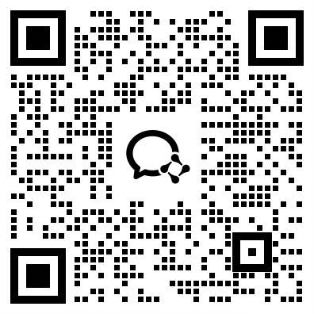

<p align="center">
  <a href="https://github.com/TiMEM-AI/timem-ai">
    
  </a>
</p>

<p align="center">
  <strong>TiMem：让你的AI随时间进化</strong>
</p>

<p align="center">
  <em>面向长程对话智能体的时序分层记忆巩固框架</em>
</p>

<p align="center">
  将<strong>无尽</strong>的对话转化为<strong>结构化、多层次</strong>的记忆，基于<strong>时序记忆树（TMT）</strong>——从细粒度证据到稳定人格。
</p>

<p align="center">
  <a href="#-快速开始"><strong>🚀 快速开始</strong></a>
  ·
  <a href="#-核心概念"><strong>🧠 核心概念</strong></a>
  ·
  <a href="#-示例代码"><strong>📖 示例代码</strong></a>
  ·
  <a href="#-云服务"><strong>☁️ 云服务</strong></a>
  ·
  <a href="docs/zh/README.md"><strong>📚 文档索引</strong></a>
  ·
  <a href="#-研究论文"><strong>📄 研究论文</strong></a>
</p>

<p align="center">
  <a href="https://timem.cloud">
    
  </a>
  <a href="https://pypi.org/project/timem-ai">
    
  </a>
  <a href="https://github.com/TiMEM-AI/timem-ai/blob/main/LICENSE">
    
  </a>
  <a href="https://github.com/TiMEM-AI/timem-ai/stargazers">
    
  </a>
</p>

> **🎉 TiMem v1.0 已发布！** 本次发布包括云服务支持、简化的 SDK 用法以及基于研究的记忆巩固。

## 🔥 TiMem 亮点

- **五级时序层次**：从片段到稳定人格的显式时序排序
- **无需微调**：基于指令引导的记忆巩固
- **复杂度感知召回**：根据查询复杂度自适应检索
- **领先性能**：在 LoCoMo、LongMemmEval-S 基准测试中表现优异

# 简介

[TiMem](https://github.com/TiMEM-AI/timem-ai) 通过 时序记忆树（TMT） 增强 AI 助手和智能体——一个智能记忆框架，将记忆组织在具有显式时序顺序的五级层次结构中。

### 核心特性与使用场景

**核心能力：**
- **时序记忆树（TMT）**：五级层次结构，具有显式时序排序
- **语义引导整合**：无需微调，基于指令引导
- **复杂度感知召回**：根据查询复杂度自适应检索范围
- **多模型支持**：OpenAI、Claude、智谱AI、千问、本地模型

**应用场景：**
- **AI 助手**：长会话中的一致性、上下文丰富对话
- **客户支持**：跨会话回忆用户历史，提供个性化帮助
- **教育**：跟踪学习进度，适应学生需求
- **生产力工具**：随着时间推移建立持久的用户画像

## 🚀 快速开始

选择使用托管云服务或本地部署：

### 云服务（推荐）

无需管理基础设施，几分钟内即可上手：

```bash
# 1. 安装 SDK
pip install timem-ai

# 2. 配置凭据
export TIMEM_BASE_URL=https://api.timem.cloud
```

```python
import asyncio
from timem import AsyncMemory

async def main():
    # 初始化客户端
    memory = AsyncMemory(
        api_key="你的API-KEY",
        base_url="https://api.timem.cloud"
    )

    # 添加对话记忆
    result = await memory.add(
        messages=[
            {"role": "user", "content": "你好，我叫张明"},
            {"role": "assistant", "content": "你好张明！"}
        ],
        user_id="user_001",
        character_id="assistant",
        session_id="session_001"
    )
    print(f"添加记忆: {'成功' if result['success'] else '失败'}")

    # 搜索相关记忆
    results = await memory.search(
        query="用户的名字",
        user_id="user_001",
        limit=5
    )
    print(f"找到 {results.get('total', 0)} 条相关记忆")

    await memory.aclose()

asyncio.run(main())
```

### 本地部署（开源）

需要数据库设置，但提供完全控制：

```bash
# 克隆仓库
git clone https://github.com/TiMEM-AI/timem-ai.git
cd timem

# 创建虚拟环境
python -m venv .venv
.venv\Scripts\activate  # Windows

# 安装依赖
pip install -r requirements.txt

# 启动数据库
cd migration && docker-compose up -d
```

## 📖 示例代码

示例文件位于 [`cloud-service/examples/`](cloud-service/examples/) 目录：

| 文件 | 说明 |
|------|------|
| [01_quick_start.py](cloud-service/examples/01_quick_start.py) | 快速开始 - 5分钟上手 |
| [02_add_memory.py](cloud-service/examples/02_add_memory.py) | 添加记忆示例 |
| [03_search_memory.py](cloud-service/examples/03_search_memory.py) | 搜索记忆示例 |
| [04_chat_demo.py](cloud-service/examples/04_chat_demo.py) | 聊天演示 - 带记忆的 AI 助手 |

### 运行示例

```bash
cd cloud-service/examples

# 配置环境变量
export TIMEM_BASE_URL=https://api.timem.cloud
export TIMEM_API_KEY=你的API_KEY

# 运行示例
python 01_quick_start.py
python 02_add_memory.py
python 03_search_memory.py
python 04_chat_demo.py
```


## 🧠 核心概念

### 系统架构

<p align="center">
  
</p>

**TiMem 架构包含三个核心组件：**

1. **记忆巩固（左侧）**：通过语义引导的巩固，将原始对话转换为 5 级层次记忆（L1-L5）

2. **时序记忆树（中间）**：以显式时序顺序组织记忆，从细粒度片段（L1）到稳定人格画像（L5）

3. **复杂度感知召回（右侧）**：根据查询复杂度自适应检索范围，平衡精度和效率

### 工作原理

```
用户："我想学 Python"

L1：提取事实 → "用户想学 Python"
L2：总结会话 → "用户开始 Python 学习之旅"
L3：每日模式 → "用户这周在学 Python"
L4：每周趋势 → "用户学习时间是工作日晚上"
L5：稳定人格 → "用户 = 正在培训的 Python 开发者"
```

后续查询："用户的的技术背景是什么？"

→ **复杂度分析**：简单事实查询
→ **层次召回**：检查 L1 → L5
→ **结果**：用户在学 Python（来自 L5 人格）
→ **回复**："根据我们的对话，你正在学习 Python..."

## ☁️ 云服务

TiMem 云服务是托管版本，无需部署即可使用。

### 🌐 控制台入口

[**控制台**](https://console.timem.cloud) — 管理 TiMem 云服务（国内）

> **注**：全球版控制台（timem.ai）即将上线。

### 快速开始

详细指南请参考：[cloud-service/README.md](cloud-service/README.md)

### 云服务 vs 本地部署

| 特性 | 云服务 | 本地部署 |
|:------|:--------|:--------|
| **部署** | 无需部署 | 需要配置 |
| **维护** | 平台管理 | 自行管理 |
| **数据控制** | 云端存储 | 完全控制 |
| **成本** | 按量付费 | 固定成本 |
| **定制化** | 有限定制 | 完全定制 |

### 相关文档

| 文档 | 说明 |
|:------|:------|
| [cloud-service/README.md](cloud-service/README.md) | 云服务完整指南 |
| [cloud-service/api/authentication.md](cloud-service/api/authentication.md) | 认证指南 |
| [cloud-service/api/reference.md](cloud-service/api/reference.md) | REST API 参考 |

## 📄 研究论文

### 论文

**TiMem：面向长程对话智能体的时序分层记忆巩固框架**

长程对话智能体需要管理不断增长的交互历史，这些历史很快就会超过大语言模型（LLM）的有限上下文窗口。现有的记忆框架对跨层次的时序结构化信息支持有限，往往导致记忆碎片化和不稳定的长程个性化。

我们提出了 TiMem，一个时序分层记忆框架，通过时序记忆树（TMT）组织对话，实现从原始对话观察到逐步抽象的人格表征的系统化记忆巩固。

### 核心特性

1. **时序层次组织**：TMT 在 5 个层次上提供显式时序排序
2. **语义引导整合**：无需微调即可实现跨层次记忆巩固
3. **复杂度感知记忆召回**：在不同复杂度的查询间平衡精度和效率

### 基准测试结果

| 基准测试 | 指标 | TiMem 性能 |
|:----------|:-----|:-----------|
| **LoCoMo** | 准确率 | **75.30%** （最优） |
| **LongMemEval-S** | 准确率 | **76.88%** （最优） |
| **LoCoMo** | 记忆压缩 | **减少 52.20%** 召回 token |

**流形分析**：TiMem 在 LoCoMo 上展现出清晰的人格分离，在 LongMemEval-S 上降低了分散度，将时序连续性作为长程对话智能体记忆的一等组织原则。

**完整论文**：[arXiv:2601.02845](https://arxiv.org/abs/2601.02845)

## 🎉 📋 更新日志

持续维护升级记录：

- **2026.02.08** - 开源仓库正式上线
- **2026.02.01** - 云服务上线内测预览版
- **2026.01.06** - TiMem 研究论文发布

---

## 📚 文档与支持

### 📖 文档
- **[完整文档](docs/zh/README.md)** - 完整文档中心
- **[开发者指南](docs/zh/developer-guide/README.md)** - 30分钟开发者快速入门

### 🔧 API 与 SDK
- **[API 参考](docs/zh/api-reference/overview.md)** - REST API 文档
- **[Python SDK](docs/zh/sdk/python/quickstart.md)** - Python 集成
- **[认证指南](docs/zh/api-reference/authentication.md)** - 认证说明

### 🛠️ 支持
- **问题反馈**：[GitHub Issues](https://github.com/TiMEM-AI/timem/issues)
- **贡献指南**：[CONTRIBUTING.md](CONTRIBUTING.md)
- **故障排查**：[docs/zh/troubleshooting.md](docs/zh/troubleshooting.md)

### 💬 社区

加入我们的中文社区获取技术支持和交流：

<p align="center">
  
  
</p>

- **微信群**: 扫码加入 TiMem 技术交流群
- **飞书群**: 扫码加入 TiMem 开发者社区


## 📝 引用

如果使用 TiMem 进行研究，请引用：

```bibtex
@misc{li2026timemtemporalhierarchicalmemoryconsolidation,
      title={TiMem: Temporal-Hierarchical Memory Consolidation for Long-Horizon Conversational Agents},
      author={Kai Li and Xuanqing Yu and Ziyi Ni and Yi Zeng and Yao Xu and Zheqing Zhang and Xin Li and Jitao Sang and Xiaogang Duan and Xuelei Wang and Chengbao Liu and Jie Tan},
      year={2026},
      eprint={2601.02845},
      archivePrefix={arXiv},
      primaryClass={cs.CL},
      url={https://arxiv.org/abs/2601.02845},
}
```

## ⚖️ 许可证

Server Side Public License (SSPL) v1 — 详见 [LICENSE](LICENSE) 文件。

**注意：** 本协议要求，如果您将 TiMem 的功能作为网络服务提供给他人使用，您必须以相同的协议开源您的修改（包括所有支持软件）。这确保了使用 TiMem 进行商业运营的云服务提供商将其改进回馈给社区。


## ⭐ Star History

[](https://star-history.com/#TiMEM-AI/timem&Date)

---

<p align="center">
  <strong>⭐ 如果 TiMem 对你有帮助，请在 GitHub 上给我们星标！</strong>
  <br><br>
  由 TiMem 团队打造
</p>
