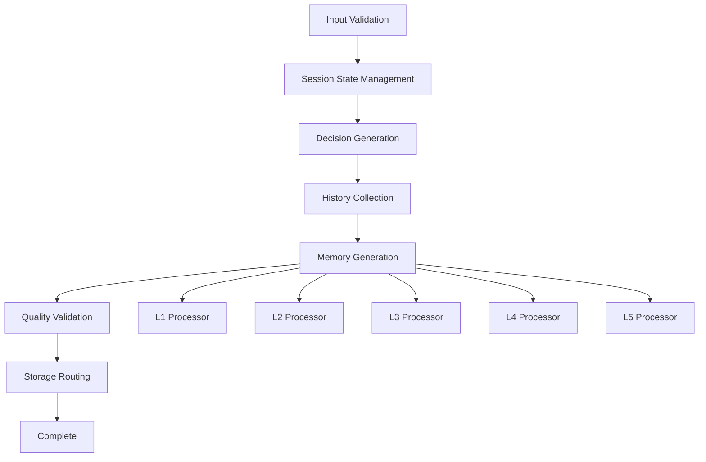
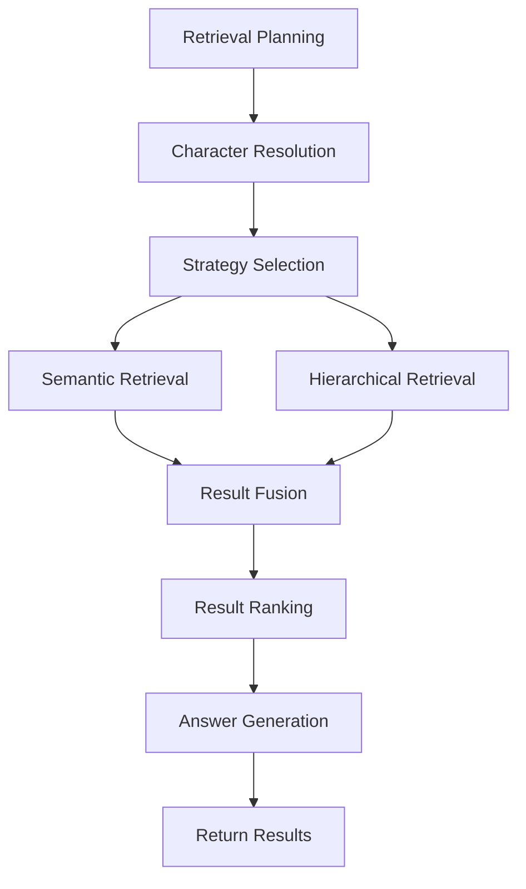

# Workflow Engine (Anonymized Artifact)

This module implements the core workflow engine of the anonymized system based on LangGraph, covering the full process of memory generation and retrieval.

## 🏗️ Architecture Design

### Workflow Types

```
workflows/
├── memory_generation.py      # Memory generation workflow
├── memory_retrieval.py       # Memory retrieval workflow  
├── memory_retrieval_refactored.py  # Refactored retrieval workflow
├── nodes/                    # Generation workflow nodes
├── retrieval_nodes/          # Retrieval workflow nodes
├── routers/                  # Routing strategies
└── state.py                  # Workflow state management
```

### Core Components

- **MemoryGenerationWorkflow**: Memory generation workflow
- **MemoryRetrievalWorkflow**: Memory retrieval workflow
- **Workflow nodes**: Various functional node implementations
- **State management**: Unified workflow state model

## 🔄 Memory Generation Workflow

### Workflow Architecture



### Main Nodes

#### 1. InputValidationNode - Input Validation Node
**Function**: Validate the completeness and validity of input data

```python
from timem.workflows.nodes.input_validation import InputValidationNode

# Create validation node
validator = InputValidationNode()

# Validate input data
validation_result = await validator.validate({
    "user_id": "user_001",
    "expert_id": "expert_001",
    "session_id": "session_001",
    "dialogues": [...],
    "time_range": {...}
})
```

#### 2. SessionStateManager - Session State Management Node
**Function**: Manage session state and determine when to generate memories

```python
from timem.workflows.nodes.session_state_manager import SessionStateManager

# Create state manager
state_manager = SessionStateManager()

# Check session state
session_state = await state_manager.check_session_state(
    session_id="session_001",
    user_id="user_001",
    expert_id="expert_001"
)
```

#### 3. Memory Processor Nodes
**Function**: Handle memory generation at different levels

```python
from timem.workflows.nodes.unified_processors import (
    L1Processor, L2MemoryProcessor, L3MemoryProcessor,
    L4MemoryProcessor, L5MemoryProcessor
)

# L1 fragment memory processor
l1_processor = L1Processor()
l1_memory = await l1_processor.process(state)

# L2 session memory processor  
l2_processor = L2MemoryProcessor()
l2_memory = await l2_processor.process(state)
```

#### 4. QualityValidator - Quality Validation Node
**Function**: Validate the quality of generated memories

```python
from timem.workflows.nodes.quality_validator import QualityValidator

# Create quality validator
validator = QualityValidator()

# Validate memory quality
quality_result = await validator.validate_memory(memory)
```

#### 5. StorageRouter - Storage Routing Node
**Function**: Route memories to appropriate storage systems

```python
from timem.workflows.nodes.storage_router import StorageRouter

# Create storage router
router = StorageRouter()

# Route memory to storage
storage_result = await router.route_memory(memory)
```

## 🔍 Memory Retrieval Workflow

### Retrieval Process



### Main Retrieval Nodes

#### 1. RetrievalPlanner - Retrieval Planning Node
**Function**: Analyze user query intent and requirements

```python
from timem.workflows.retrieval_nodes.retrieval_planner import RetrievalPlanner

# Create retrieval planner
planner = RetrievalPlanner()

# Plan retrieval (analyze the query)
analysis_result = await planner.run({
    "question": "What are the user's learning preferences?",
    "user_id": "user_001",
    "expert_id": "expert_001",
})
```

#### 2. CharacterResolver - Character Resolution Node
**Function**: Resolve character information in queries

```python
from timem.workflows.retrieval_nodes.character_resolver import CharacterResolver

# Create character resolver
resolver = CharacterResolver()

# Resolve character
character_info = await resolver.resolve_character(
    query="User's learning preferences",
    context={...}
)
```

#### 3. StrategySelector - Strategy Selection Node
**Function**: Select retrieval strategy based on query type

```python
from timem.workflows.retrieval_nodes.strategy_selector import StrategySelector

# Create strategy selector
selector = StrategySelector()

# Select retrieval strategy
strategy = await selector.select_strategy(
    query_analysis=analysis_result,
    user_context={...}
)
```

#### 4. SemanticRetriever - Semantic Retrieval Node
**Function**: Retrieval based on semantic similarity

```python
from timem.workflows.retrieval_nodes.semantic_retriever import SemanticRetriever

# Create semantic retriever
retriever = SemanticRetriever()

# Perform semantic retrieval
semantic_results = await retriever.retrieve(
    query="learning preferences",
    user_id="user_001",
    expert_id="expert_001",
    limit=10
)
```

#### 5. HierarchicalRetriever - Hierarchical Retrieval Node
**Function**: Hierarchical retrieval based on memory levels

```python
from timem.workflows.retrieval_nodes.hierarchical_retriever import HierarchicalRetriever

# Create hierarchical retriever
hierarchical_retriever = HierarchicalRetriever()

# Perform hierarchical retrieval
hierarchical_results = await hierarchical_retriever.retrieve(
    query="learning preferences",
    levels=["L2", "L3", "L4"],
    user_id="user_001",
    expert_id="expert_001"
)
```

#### 6. ResultsFuser - Result Fusion Node
**Function**: Fuse multiple retrieval results

```python
from timem.workflows.retrieval_nodes.results_fuser import ResultsFuser

# Create result fuser
fuser = ResultsFuser()

# Fuse retrieval results
fused_results = await fuser.fuse_results([
    semantic_results,
    hierarchical_results,
    keyword_results
])
```

#### 7. ResultsRanker - Result Ranking Node
**Function**: Rank fused results

```python
from timem.workflows.retrieval_nodes.results_ranker import ResultsRanker

# Create result ranker
ranker = ResultsRanker()

# Rank results
ranked_results = await ranker.rank_results(
    results=fused_results,
    query="learning preferences",
    user_context={...}
)
```

#### 8. AnswerGenerator - Answer Generation Node
**Function**: Generate final answer based on retrieval results

```python
from timem.workflows.retrieval_nodes.answer_generator import AnswerGenerator

# Create answer generator
generator = AnswerGenerator()

# Generate answer
answer = await generator.generate_answer(
    query="learning preferences",
    retrieved_memories=ranked_results,
    user_context={...}
)
```

## 📊 Workflow State Management

### State Model

```python
from timem.workflows.state import MemoryState, RetrievalState

# Memory generation state
memory_state = MemoryState(
    user_id="user_001",
    expert_id="expert_001",
    session_id="session_001",
    input_data={...},
    generated_memories={...},
    quality_scores={...}
)

# Retrieval state
retrieval_state = RetrievalState(
    query="learning preferences",
    user_id="user_001",
    expert_id="expert_001",
    analysis_result={...},
    retrieved_results={...},
    final_answer="..."
)
```

### State Validation

```python
from timem.workflows.state import MemoryStateValidator

# Create state validator
validator = MemoryStateValidator()

# Validate state
is_valid = await validator.validate_state(memory_state)
if not is_valid:
    errors = validator.get_validation_errors()
    print(f"State validation failed: {errors}")
```

## 🚀 Usage Examples

### Memory Generation Workflow

```python
from timem.workflows.memory_generation import MemoryGenerationWorkflow

# Create workflow
workflow = MemoryGenerationWorkflow()

# Run memory generation
result = await workflow.run({
    "user_id": "user_001",
    "expert_id": "expert_001",
    "session_id": "session_001",
    "dialogues": [...],
    "time_range": {
        "start": "2025-01-01T10:00:00",
        "end": "2025-01-01T11:00:00"
    }
})

print(f"Generation result: {result.status}")
print(f"Generated memories: {result.memories}")
```

### Memory Retrieval Workflow

```python
from timem.workflows.memory_retrieval import MemoryRetrievalWorkflow

# Create retrieval workflow
retrieval_workflow = MemoryRetrievalWorkflow()

# Perform retrieval
result = await retrieval_workflow.retrieve({
    "query": "What are the user's learning preferences?",
    "user_id": "user_001",
    "expert_id": "expert_001",
    "max_results": 10
})

print(f"Retrieval result: {result.answer}")
print(f"Related memories: {result.memories}")
```

## Configuration

### Workflow Configuration

```yaml
workflows:
  memory_generation:
    timeout: 300  # Timeout (seconds)
    retry_count: 3  # Retry count
    parallel_processing: true  # Parallel processing
  memory_retrieval:
    max_results: 20  # Maximum results
    similarity_threshold: 0.7  # Similarity threshold
    fusion_strategy: "weighted"  # Fusion strategy
```

### Node Configuration

```yaml
nodes:
  input_validation:
    strict_mode: true  # Strict validation mode
    required_fields: ["user_id", "expert_id", "session_id"]
  quality_validator:
    min_score: 0.8  # Minimum quality score
    check_grammar: true  # Grammar check
  storage_router:
    default_storage: "postgres"  # Default storage
    vector_storage: "qdrant"  # Vector storage
```

## 🔧 Custom Nodes

### Create Custom Node

```python
from timem.workflows.nodes.base_processor import BaseProcessor

class CustomProcessor(BaseProcessor):
    """Custom processor node"""
    
    async def process(self, state: MemoryState) -> MemoryState:
        """Process state"""
        # Custom processing logic
        processed_data = self.custom_logic(state.input_data)
        
        # Update state
        state.processed_data = processed_data
        return state
    
    def custom_logic(self, data):
        """Custom business logic"""
        # Implement specific processing logic
        return processed_data
```

### Register Custom Node

```python
from timem.workflows.memory_generation import MemoryGenerationWorkflow

# Create workflow
workflow = MemoryGenerationWorkflow()

# Register custom node
workflow.add_node("custom_processor", CustomProcessor())

# Add node to workflow
workflow.add_edge("input_validation", "custom_processor")
workflow.add_edge("custom_processor", "memory_generation")
```

## 🧪 Testing

### Unit Testing

```bash
# Test memory generation workflow
pytest tests/unit/test_memory_generation_workflow.py -v

# Test retrieval workflow
pytest tests/unit/test_memory_retrieval_workflow.py -v

# Test node functionality
pytest tests/unit/test_workflow_nodes.py -v
```

### Integration Testing

```bash
# Test complete workflow
pytest tests/integration/test_workflow_integration.py -v

# Test workflow state management
pytest tests/integration/test_workflow_state.py -v
```

## 📈 Performance Optimization

### Concurrent Processing

```python
# Enable concurrent processing
workflow = MemoryGenerationWorkflow(
    enable_parallel=True,
    max_workers=4
)
```

### Caching Mechanism

```python
# Enable node caching
workflow = MemoryGenerationWorkflow(
    enable_caching=True,
    cache_ttl=3600
)
```

### Resource Management

```python
# Configure resource limits
workflow = MemoryGenerationWorkflow(
    memory_limit="2GB",
    cpu_limit=4,
    timeout=300
)
```

## 🚨 Troubleshooting

### Common Issues

1. **Workflow execution failed**
   - Check node dependencies
   - Validate input data format
   - Review error logs

2. **Node processing timeout**
   - Adjust timeout configuration
   - Optimize processing logic
   - Increase resource allocation

3. **State validation failed**
   - Check state model definition
   - Validate data completeness
   - Fix validation rules

### Debug Mode

```python
# Enable debug mode
workflow = MemoryGenerationWorkflow(debug_mode=True)

# View detailed logs
import logging
logging.getLogger("timem.workflows").setLevel(logging.DEBUG)
```

## 📚 Related Documentation

- [Memory Level Module](../memory/README.md)
- [Data Models](../models/README.md)
- [Core Services](../core/README.md)
- [Utility Functions](../utils/README.md)
